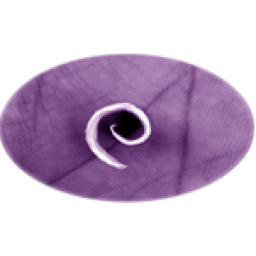
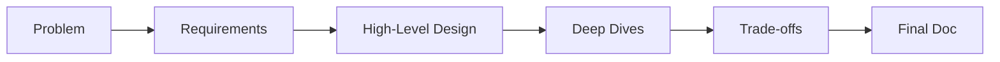

# System Design Lab 

  

A collection of system design projects and templates that turn vague ideas into structured, reviewable designs. Each project follows the same flow: define requirements, outline architecture, dive into trade-offs, and capture decisions in a consistent, reusable format.

> This repository helps you move from "I have an idea" to "I have a design" faster, with clear artifacts you can share with teammates, interviewers, or future you.

## What this repository does
- Provides a repeatable framework for capturing functional and non-functional requirements.
- Encourages explicit trade-offs and assumptions so designs are defensible.
- Stores designs as modular projects so you can compare patterns across domains.
- Makes it easy to extend with new case studies using the same structure.

## How it helps
- Speeds up design thinking with a structured template.
- Improves communication by documenting decisions in one place.
- Creates a portfolio of system design work that is easy to review and evolve.

## Projects

| Project | Description | Status | Link |
| --- | --- | --- | --- |
| Email Service Provider | Multi-tenant email delivery platform design covering requirements, architecture, and deep dives into scalability and reliability. | In progress | [email-service-provider](email-service-provider/readme.md) |

## Repository layout
- `email-service-provider/` - Full project: requirements, architecture, deep dives, and assets.
- `framework/` - Reusable template for new system design projects.

## Design workflow (visual overview)

## Start a new project

1. Copy the template from `framework/` into a new project folder.
2. Rename the folder and update the `readme.md` with your problem statement.
3. Fill in requirements and iterate on the design artifacts.

## Roadmap
- [x] Establish a reusable design template
- [x] First case study: Email Service Provider
- [ ] Add more case studies (payments, search, analytics, etc.)
- [ ] Cross-project comparison notes and common patterns

## Reference checklist
- Problem statement
- Functional requirements
- Non-functional requirements
- High-level architecture
- Deep dives and trade-offs

Why this format?

This structure mirrors how real systems are designed: define requirements, make architectural choices, then document trade-offs. It keeps designs consistent, reviewable, and easy to evolve over time.

